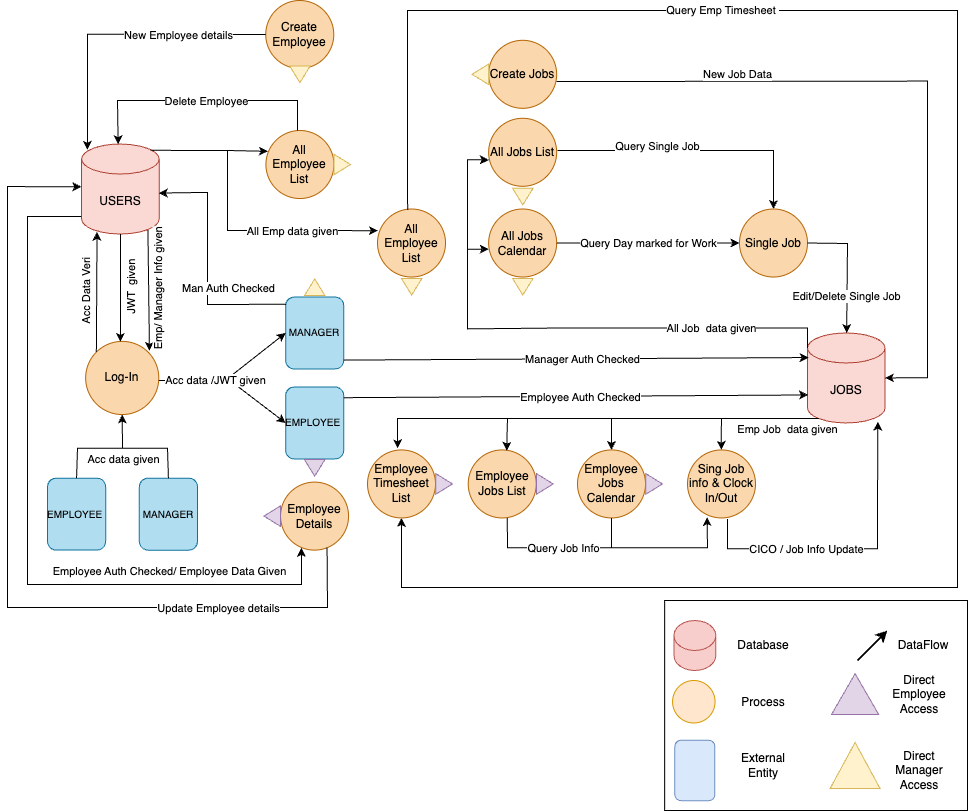
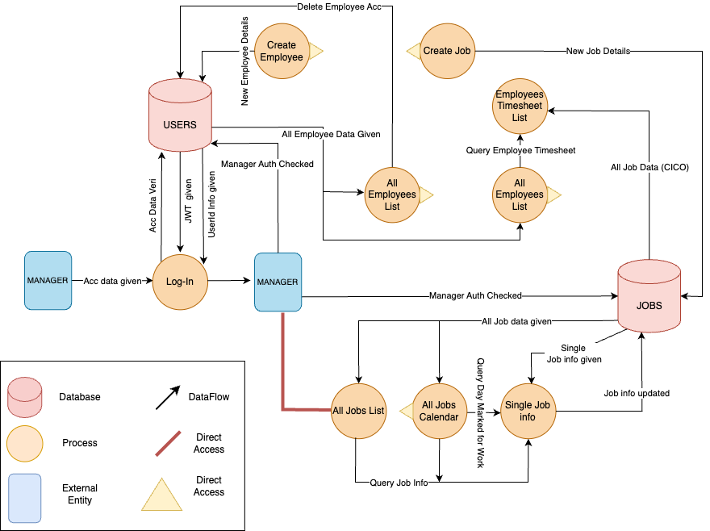
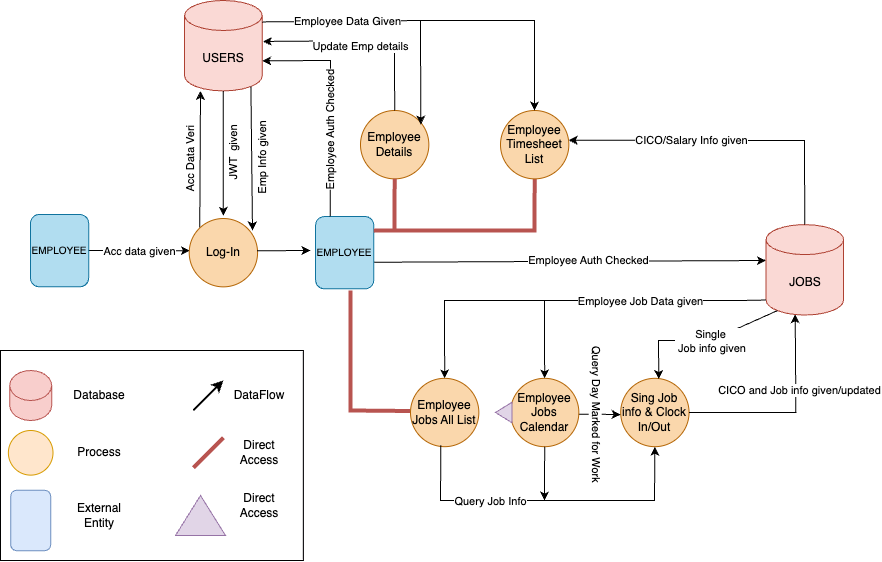
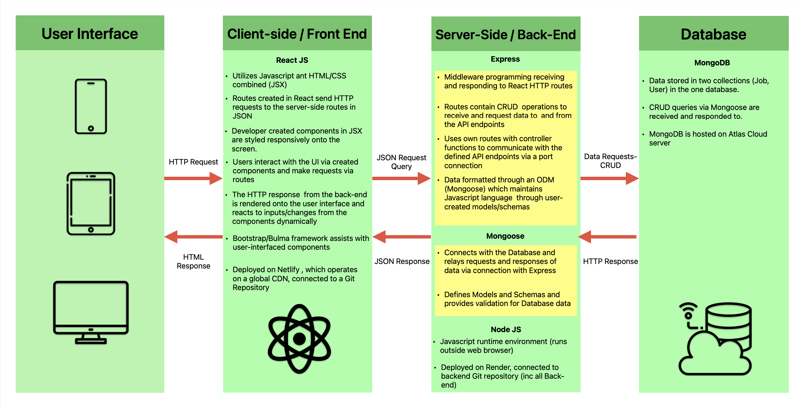
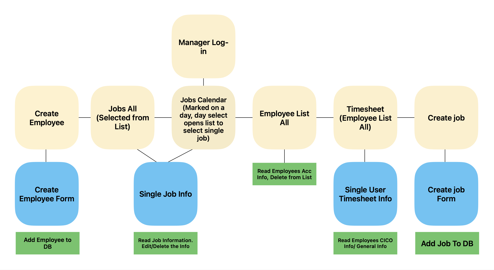
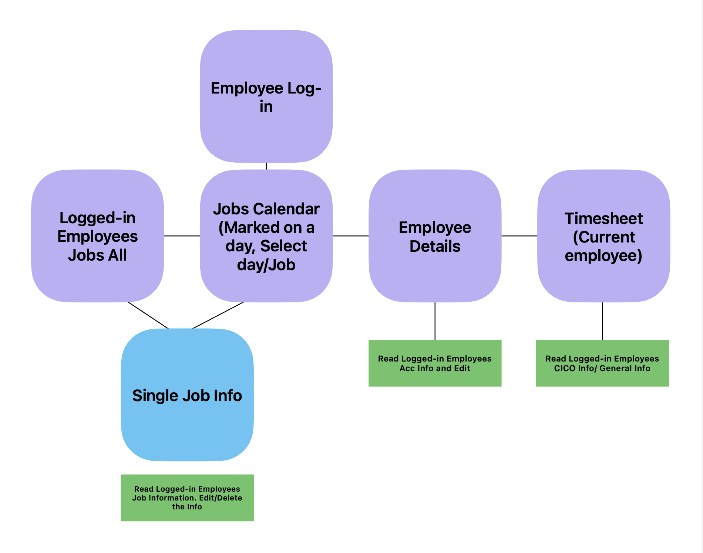

# T3A2-A - Full Stack App (Part A)

## Landscaping Business Scheduling and Operation Platform - Green Thumb
### Harry, Connor and Adam.

#### **README Contents:**
1. [Project Purpose](#Project-Purpose)  
1. [Functionality and Features](#Functionality-and-Features)  
1. [Target Audience](#Target-Audience)  
1. [Tech Stack](#Tech-Stack)  
1. [Data Flow Diagrams](#Data-Flow-Diagrams)

1. [Application Architecture Diagrams](#Application-Architecture-Diagrams)  
1. [User Stories](#User-Stories)  
1. [Wireframes](#Wireframes)
   - [Site Flow Maps](#Site-Flow)
   - [Mobile](#Mobile)
   - [Tablet](#Tablet)
   - [Desktop](#Desktop)  

1. [Project Management](#Project-Management)

### Purpose

Green Thumb, a local landscaping company, faces challenges in managing their growing business, particularly internal communication. Essential job details such as addresses, tasks, and customer requests are not effectively communicated to staff, resulting in inefficiencies and customer dissatisfaction. To address this, our team has been tasked with developing a tailored operational team/task management web application. The purpose is to streamline communication, enhance customer satisfaction, and improve efficiency by providing a platform that:

- Communicates scheduling information to multiple staff members across various ongoing jobs.
- Maintains customer satisfaction through an internal noting system ensuring employees understand customer needs.
- Tracks employees' working hours with a clock-in/clock-out mechanism.
- Manages and stores job and employee information for easy reference.

The application aims to alleviate management's workload, enabling them to focus on key growth areas and enhance scalability.
 

### Functionality and Features
The Green Thumb web application is designed for task, team, and record management specific to a growing landscape company. It serves as the primary operating platform for both management and employee staff to communicate job information without reliance on phone calls or face-to-face interactions. Additionally, it acts as a repository for past job data and notes, aiding accounting and general operational information storage.
 
**1. Account Authorization:**
   - The application employs coded authorization methods to allocate permissions and functionality, ensuring ease of use for both employees and management.
   - Employees access only necessary functionalities, reducing the need for extensive training.
   - Management retains control over job and employee information while maintaining simplicity.

**2. Communication via Job Updates:**
   - Employees can update job statuses and provide key information via the application's interface.
   - Management stays informed about completed tasks and relevant notes without direct communication.
   - Initial job communication can also occur within the application.

**3. Bookkeeping:**
   - The application tracks individual employee working hours, crucial for financial management.
   - Employees clock in and out through the application, allowing for easy monitoring by management.
   - Management can address discrepancies or additional information needs directly within job notes.

**4. Job Control:**
   - Management enters job details into a user-friendly form, customizable to suit job parameters.
   - Job progress is monitored, and completed jobs can be closed, with data saved for future reference.

**5. Schedule Calendar:**
   - A user-specific schedule calendar displays assigned jobs for employees and all current and future jobs for managers.
   - Managers can easily access job information for scheduling and monitoring purposes, streamlining navigation within the application.
 

### Target Audience
Landscaping businesses would be able to use this app as a way to support their employees and monitor their staff productivity. Managers would be able to create jobs easily and monitor their progress. Staff can relay information about the job back to the office without having to spend time on the phone. 

 

### Tech Stack
For this application we will be using:

* Front-end:
HTML, CSS, JavaScript, React. React will be used to render the content of the application and create a responsive and interactive front-end.

* Back-end:
Node.js, Express.js. Both of these will work in tandem. Node will allow the app to utilise JavaScript on the server-side and express will be used to create the API.

* Database: Mongo DB. Mongo will be the database which stores all of the information on our app. Including jobs, employees etc.

* Authentication: JWT is a common authentication mechanism which we will be utilizing to authenticate users.

* Encryption: Bcrypt. Bcrypt is used to hash passwords and encrypt data for privacy.

* Testing: Vite, Jest. We will be implementing both testing frameworks for the application. This will be useful to cover all bases around testing.

* Others: Discord, Figma, Draw.io, Trello. Discord is used for communication in the team. Figma and Draw.io is used for wiremapping and planning. Trello is used as a team board to cover all tasks.

 

### Data Flow Diagrams
#### Overview

  
  

#### Manager Data Flow

  
  

#### Employee Data Flow

  
  

 

### Application Architecture Diagram

  
  

 

### User Stories
- As a manager/owner, I want to be able to create new jobs within the app, including specifying the job title, address, any special requests, and assigning employees to the job.

- As a manager/owner, I want to view a list of all jobs, including their status (e.g., pending, in progress, completed), so that I can track the progress of each job and manage the workload efficiently.

- As a manager/owner, I want to review completed jobs, including any notes left by employees and customer feedback, to ensure that the work meets quality standards and address any issues that arise.

- As an employee, I want to see a list of upcoming jobs assigned to me, along with relevant details such as the job title, address, and any special instructions, so that I can prepare for my workday.

 - As an employee, I want to clock in and out for each work order directly within the app, to accurately track my hours worked and ensure that I am paid correctly.

 - As an employee, I want to leave notes on each job, such as any issues encountered, additional equipment used, or positive feedback from the customer, to provide detailed information to the manager/owner and improve communication within the team.

 - As a customer, I want to create an account within the app, so that I can easily submit requests for landscaping services and track the status of my requests.

 - As a customer, I want to submit a request for a job, including providing details such as the job title, address, any special instructions, and preferred dates/times for the service, to ensure that my needs are clearly communicated to the landscaping company.

 - As a customer, I want to receive notifications and updates on the status of my job request, including when it has been assigned to an employee and when the work is completed, to stay informed throughout the process.

 - As a customer, I want to leave feedback and ratings for completed jobs, to share my experience with the landscaping company and help improve their services for future customers.

 

### Wireframes

#### *Site Flow*
##### Manager-side Flow

  
  

##### Employee-side Flow

  
  

#### Brainstorm

Our first wireframe was quick concepts thrown together by conversation within our team. 

###### First Meeting

Our first meeting involed all team member critiques of the initial wireframe, where we unanimously voiced the features we wanted to create and developed a scope for the MVP.

###### Second Meeting

The Second meeting commenced soon after the first and was to ensure the direct off the app was achieved. all that was left to do was to clean up for delivery.

###### Final Mobile Wireframe/ Initial Desktop

The final draft of the mobile wireframe was reviewed and accepted by the team and we began envisioning the Desktop view. We all contributed our ideas on how the app should respond when viewed on its largest device and how to leverage our component for efficient rendering.

We all could envision the direction of the application and agreed that the next meeting would be a review the desktops and tablets final draft.

###### Final Wireframes

Below are the final wireframes that will link you to figma.

###### Mobile

###### Tablet

###### Desktop

### Project Management

#### Trello Link

#### Daily Progress

