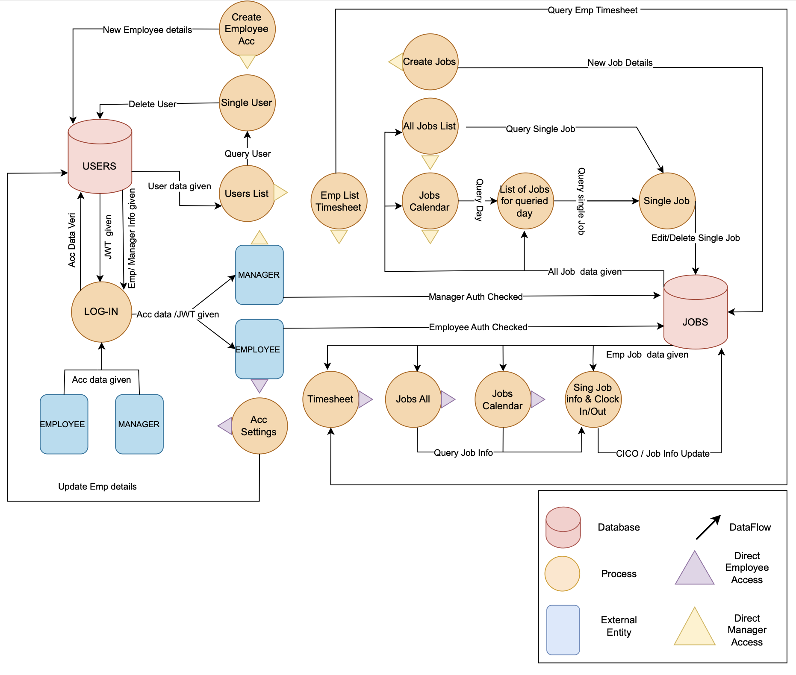

# T3A2-A - Full Stack App (Part A)

## Landscaping Business Scheduling and Operation Platform - Green Thumb
### Harry, Connor and Adam.

#### **README Contents:**
1. [Project Purpose](#Project-Purpose)  
1. [Functionality and Features](#Functionality-and-Features)  
1. [Target Audience](#Target-Audience)  
1. [Tech Stack](#Tech-Stack)  
1. [Data Flow Diagrams](#Data-Flow-Diagrams)

1. [Application Architecture Diagrams](#Application-Architecture-Diagrams)  
1. [User Stories](#User-Stories)  
1. [Wireframes](#Wireframes) 
   - [Mobile](#Mobile)
   - [Tablet](#Tablet)
   - [Desktop](#Desktop)  

1. [Project Management](#Project-Management)

### Purpose

 

### Functionality and Features

 

### Target Audience

 

### Tech Stack
For this application we will be using:

* Front-end:
HTML, CSS, JavaScript, React. React will be used to render the content of the application and create a responsive and interactive front-end.

* Back-end:
Node.js, Express.js. Both of these will work in tandem. Node will allow the app to utilise JavaScript on the server-side and express will be used to create the API.

* Database: Mongo DB. Mongo will be the database which stores all of the information on our app. Including jobs, employees etc.

* Authentication: JWT is a common authentication mechanism which we will be utilizing to authenticate users.

* Encryption: Bcrypt. Bcrypt is used to hash passwords and encrypt data for privacy.

* Testing: Vite, Jest. We will be implementing both testing frameworks for the application. This will be useful to cover all bases around testing.

* Others: Discord, Figma, Trello. Discord is used for communication in the team. Figma is used for wiremapping and planning. Trello is used as a team board to cover all tasks.

 

### Data Flow Diagrams

  
  

 

### Application Architecture Diagram

 

### User Stories
As a manager/owner, I want to be able to create new jobs within the app, including specifying the job title, address, any special requests, and assigning employees to the job.

As a manager/owner, I want to view a list of all jobs, including their status (e.g., pending, in progress, completed), so that I can track the progress of each job and manage the workload efficiently.

As a manager/owner, I want to review completed jobs, including any notes left by employees and customer feedback, to ensure that the work meets quality standards and address any issues that arise.

As an employee, I want to see a list of upcoming jobs assigned to me, along with relevant details such as the job title, address, and any special instructions, so that I can prepare for my workday.

As an employee, I want to clock in and out for each work order directly within the app, to accurately track my hours worked and ensure that I am paid correctly.

As an employee, I want to leave notes on each job, such as any issues encountered, additional equipment used, or positive feedback from the customer, to provide detailed information to the manager/owner and improve communication within the team.

As a customer, I want to create an account within the app, so that I can easily submit requests for landscaping services and track the status of my requests.

As a customer, I want to submit a request for a job, including providing details such as the job title, address, any special instructions, and preferred dates/times for the service, to ensure that my needs are clearly communicated to the landscaping company.

As a customer, I want to receive notifications and updates on the status of my job request, including when it has been assigned to an employee and when the work is completed, to stay informed throughout the process.

As a customer, I want to leave feedback and ratings for completed jobs, to share my experience with the landscaping company and help improve their services for future customers.

 

### Wireframes

#### *Site Flow*

#### *Mobile*

#### *Tablet*

#### *Desktop*

### Project Management

